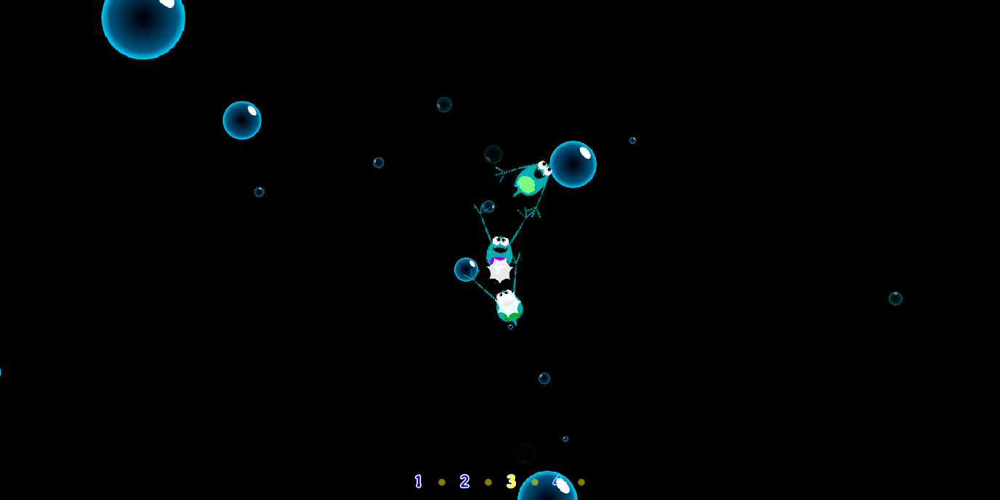

# Small Row

...is my entry for the 2025 LittleJS game jam. It's a rhythm game based on another rhythm game, [*Micro Row*](https://rhythmheaven.fandom.com/wiki/Micro-Row) from Nintendo's Rhythm Heaven series.

## Making

The game art were created in [Inkscape](inkscape.org/). The animations were created with the help of [Friction](https://friction.graphics/).

[This web.dev article](https://web.dev/articles/audio-scheduling) was instrumental in getting the rhythm mechanic of the game right.

Tween animations provided by [EthanSuperior's implementation](https://github.com/KilledByAPixel/LittleJS/issues/112).
